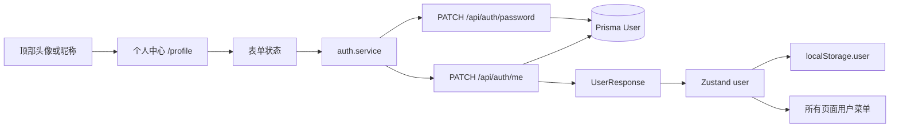

# 个人中心与账号设置开发计划

> 状态：已实施，已完成本地自动化与关键真实流程验收
>
> 编写日期：2026-08-12

## 1. 目标与交付边界

### 1.1 目标

为登录后的“小窝牛”增加统一的个人中心入口和账号设置能力，使用户可以：

- 查看自己的用户名、邮箱、昵称和账号基本信息。
- 修改昵称，支持清空昵称。
- 修改密码，要求验证当前密码并确认新密码。
- 在修改昵称后立即看到所有页面同步更新的昵称。
- 在桌面端和移动端都能稳定找到个人中心，不增加业务导航复杂度。

### 1.2 首期范围

首期实现：

- 独立受保护页面 `/profile`。
- 登录后所有页面顶部统一的头像/昵称用户菜单。
- 基本资料卡：昵称编辑、用户名只读、邮箱只读。
- 账号安全卡：当前密码、新密码、确认新密码。
- 修改昵称和修改密码的前后端 API、错误处理、测试和文档。
- 响应式布局、键盘操作、基础无障碍语义和本地真实流程验收。

首期不实现：

- 头像上传或裁剪。
- 修改用户名、修改邮箱。
- 注销账号。
- 登录设备管理、登录历史、所有设备退出。
- 找回密码、邮箱/短信验证码和二次认证。
- Staging/生产部署、生产迁移、备份、回滚或域名配置。

### 1.3 数据库结论

当前 `backend/prisma/schema.prisma` 的 `User` 模型已经具备本期需要的字段：

- `username`
- `email`
- `password`
- `nickname`
- `avatarUrl`
- `updatedAt`

因此本期预计不需要修改 Prisma schema，也不需要新增 migration。实施时若发现目标数据库与仓库 schema 不一致，必须暂停实现并单独确认迁移方案，不能为了推进页面而绕过迁移流程。

## 2. 当前仓库依据

本计划基于当前工作区代码整理：

| 现状 | 代码依据 | 计划影响 |
|---|---|---|
| 登录后页面使用受保护路由 | `frontend/src/routes/index.tsx`、`frontend/src/routes/ProtectedRoute.tsx` | `/profile` 复用 `ProtectedRoute` |
| 顶部已有登出入口 | `frontend/src/pages/Dashboard.tsx` 及四个业务页面 | 抽取统一 `AccountMenu`，替换重复登出 UI |
| 移动端底部已有五个业务 Tab | `frontend/src/components/navigation/MobileTabBar.tsx` | 不增加第六个个人中心 Tab |
| auth store 持有 `user`、Token 和认证状态 | `frontend/src/store/auth.store.ts` | 昵称更新后同步 Zustand 与 `localStorage.user` |
| 已有 `/api/auth/me` | `backend/src/routes/auth.routes.ts`、`auth.controller.ts`、`auth.service.ts` | 复用当前用户查询，新增更新接口 |
| 已有 bcryptjs 工具 | `backend/src/utils/password.ts` | 密码修改复用 `comparePassword` 和 `hashPassword` |
| shared 已维护认证 DTO | `shared/src/types/api/auth.ts` | 新请求类型放在 shared，避免前后端重复定义 |
| 后端采用 routes → controllers → services → Prisma | `backend/src/` | 新接口保持既有分层和中间件顺序 |

当前检查到工作区在 `main` 分支且没有已有未提交修改。本计划只新增文档，不改变业务代码。

## 3. 产品方案

### 3.1 入口位置

个人中心不加入底部主导航。底部导航继续只承载：世界、瘦瘦瘦、学学学、省省省、嫁嫁嫁五个高频业务入口。

所有登录后页面的顶部右侧统一显示用户菜单：

- 有昵称时显示昵称；没有昵称时显示用户名。
- 有头像时显示头像；首期没有头像时显示昵称或用户名首字符作为占位。
- 点击头像/昵称打开浮层菜单。
- 菜单包含“个人中心”和“登出”。
- 点击外部区域或按 `Escape`关闭浮层，焦点返回触发按钮。
- 触发按钮和菜单项触控区域不小于 44px。

需要接入统一入口的页面：

- `/dashboard`
- `/fitness`
- `/learning`
- `/finance`
- `/wedding`
- `/profile`

### 3.2 个人中心页面

页面路径：`/profile`。

页面顶部保留品牌、返回“世界仪表盘”入口和 `AccountMenu`；主体标题为“个人中心”，副标题为“管理你的资料和账号安全”。

页面分为两张卡片：

#### 基本资料

- 昵称：可编辑，最多 50 个字符。
- 用户名：只读。
- 邮箱：只读。
- 头像：首期只展示默认占位，不显示上传操作。
- 按钮：`保存昵称`。
- 输入先 trim；空字符串提交为 `null`，表示清空昵称。
- 保存成功后立即更新当前页面和其他页面顶部菜单的昵称。

#### 账号安全

- 当前密码：`type=password`，`autocomplete=current-password`。
- 新密码：`type=password`，`autocomplete=new-password`。
- 确认新密码：`type=password`，`autocomplete=new-password`。
- 按钮：`修改密码`。
- 新密码至少 6 位，确认密码必须一致，且新密码不能与当前密码相同。
- 成功后清空三个密码输入框并显示成功提示。
- 失败时保留输入，便于用户修正；密码不进入 URL、localStorage、Zustand 用户对象或日志。

### 3.3 页面状态

两个卡片的 loading、success、error 状态相互独立：

- 初始资料：使用 auth store 中已保存的用户资料；如进入页面时刷新 `/me`，只在表单尚未编辑时同步服务器结果。
- 保存中：对应表单的输入和按钮禁用，另一个卡片仍可用。
- 成功：使用 `role="status"` 或 `aria-live`提示。
- 参数错误：优先显示字段级提示，并关联到对应输入。
- 网络/服务错误：显示可理解的卡片级错误，保留用户可修正的输入。
- Token 失效：沿用现有 Axios 401 处理，清理认证信息并跳转 `/login`。

## 4. API 与共享类型设计

### 4.1 Shared DTO

修改 `shared/src/types/api/auth.ts`，新增：

```ts
export interface UpdateProfileRequest {
  nickname: string | null
}

export interface ChangePasswordRequest {
  currentPassword: string
  newPassword: string
}
```

约束：

- `confirmPassword`只在前端表单中使用，不发送给后端。
- 不添加 `userId`；用户身份只能从 JWT 的 `req.user.userId`获取。
- `UserResponse`保持现有字段，不增加 password 或密码哈希字段。

### 4.2 修改昵称接口

请求：

```http
PATCH /api/auth/me
Authorization: Bearer <token>
Content-Type: application/json
```

```json
{
  "nickname": "花花"
}
```

清空昵称：

```json
{
  "nickname": null
}
```

服务端规则：

- 请求体必须包含 `nickname`。
- 字符串先 trim，再校验最多 50 个字符。
- trim 后为空的字符串规范化为 `null`。
- 拒绝未知字段，避免误把 email、password 等字段传入更新逻辑。
- Prisma 更新条件必须是 `{ id: req.user.userId }`。
- 只允许更新 `nickname`，不允许通过此接口修改 username、email、avatarUrl。

成功返回完整 `UserResponse`，消息为“个人资料更新成功”。不返回 password。

### 4.3 修改密码接口

请求：

```http
PATCH /api/auth/password
Authorization: Bearer <token>
Content-Type: application/json
```

```json
{
  "currentPassword": "old-password",
  "newPassword": "new-password"
}
```

服务端规则：

- `currentPassword`、`newPassword`必须是字符串。
- 当前密码不能为空，新密码沿用注册时至少 6 位的规则。
- 拒绝未知字段；`confirmPassword`不属于后端接口契约。
- 先按 JWT userId 查询用户并比较当前密码。
- 当前密码错误时不得调用 Prisma update。
- 新旧密码相同时拒绝更新。
- 新密码通过校验后使用 `hashPassword`，只更新 password 字段。
- 成功返回 `data: null`，消息为“密码修改成功”。
- 本期保留当前 JWT 登录状态；所有设备退出属于后续会话管理需求。

错误约定：

| HTTP | code | 使用场景 |
|---:|---|---|
| 400 | `VALIDATION_ERROR` | 字段缺失、密码过短、昵称过长或未知字段 |
| 400 | `INVALID_CURRENT_PASSWORD` | 当前密码不正确 |
| 400 | `PASSWORD_UNCHANGED` | 新密码与当前密码相同 |
| 401 | `UNAUTHORIZED` | 未登录或 Token 失效 |
| 404 | `NOT_FOUND` | 当前用户不存在 |

业务错误使用明确的 error code 或错误类型，不继续依赖模糊的字符串包含判断。

## 5. 技术架构

### 5.1 前端

- `auth.service.ts`：发送请求、解包统一 response envelope。
- `auth.store.ts`：提供更新当前用户资料和修改密码 action；资料成功后同步 Zustand 与 `localStorage.user`。
- `useAuth.ts`：暴露新增 action 给页面和全局菜单。
- `AccountMenu.tsx`：只负责全局入口、浮层、个人中心导航和登出。
- `Profile/index.tsx`：负责页面布局、表单状态、字段校验和提示。
- `ProtectedRoute`：负责 `/profile` 访问控制。

不引入 React Query、全局事件总线、新的状态管理方案或第二套组件库；复用现有 Zustand、Axios、Radix Popover、Button、Input、Label 和 Tailwind 约定。

### 5.2 后端

- `auth.routes.ts`：注册两个受保护 PATCH 路由和 Zod schema。
- `auth.controller.ts`：从 `req.user.userId`取身份，映射已知业务错误，返回统一包络。
- `auth.service.ts`：执行用户资料更新、旧密码校验、哈希和用户隔离。
- `password.ts`：继续复用现有 bcryptjs 工具。
- `backend/API.md`：补充接口、错误和安全边界。

路由中间件顺序固定为：

```text
authMiddleware → validateRequest → bound controller method
```

### 5.3 数据流



## 6. 详细实施步骤

### 任务 0：建立实现基线

动作：

1. 确认工作区状态和当前分支；不得覆盖用户已有修改。
2. 确认 `User` schema 已支持 nickname/password/updatedAt；本期不预先创建迁移。
3. 冻结本计划中的 API 路径、错误 code、空昵称语义和入口位置。
4. 运行现有最小基线验证，记录与本功能无关的既有失败，不把它们归因于本功能。

完成条件：

- [x] API 契约和首期边界无未决冲突。
- [x] 确认不需要 schema 变更或迁移。

依赖：无。

### 任务 1：补充 shared 认证类型

文件：

- 修改 `shared/src/types/api/auth.ts`。
- 如有必要修改 `shared/src/index.ts`，确保从包入口导出。

动作：

1. 新增 `UpdateProfileRequest`、`ChangePasswordRequest`。
2. 保持 `UserResponse`不包含敏感字段。
3. 运行 shared build，确认前后端都能从 `@xiaowoniu/shared`导入。

验证：

```bash
pnpm --filter @xiaowoniu/shared build
```

完成条件：

- [x] 新 DTO 编译通过。
- [x] 前后端没有重复定义同名 API 类型。

依赖：任务 0。

### 任务 2：实现后端 API

文件：

- 修改 `backend/src/routes/auth.routes.ts`。
- 修改 `backend/src/controllers/auth.controller.ts`。
- 修改 `backend/src/services/auth.service.ts`。
- 视需要新增明确的认证业务错误定义文件。
- 新增/修改 `backend/src/__tests__/auth.service.test.ts`。
- 新增/修改 `backend/src/__tests__/auth.routes.test.ts`。
- 修改 `backend/API.md`。

动作：

1. 注册 `PATCH /me`和 `PATCH /password`，均使用认证和 Zod 校验。
2. 在 service 中只使用 `req.user.userId`对应的用户。
3. 昵称 trim、空值转 null、只更新允许字段。
4. 密码按“查用户 → compare 当前密码 → 检查新旧不同 → hash 新密码 → update”顺序执行。
5. 返回值统一使用 `toUserResponse`；密码接口不返回用户对象。
6. 更新 API 文档中的请求、响应、错误 code 和鉴权说明。

后端 service 测试至少覆盖：

- 昵称成功更新并 trim。
- 清空昵称写入 null。
- 更新只带当前 userId 和 nickname 字段。
- 当前用户不存在。
- 当前密码正确时生成新哈希并更新 password。
- 当前密码错误时不调用 update。
- 新旧密码相同时不调用 update。
- 返回 DTO 不包含 password/hash。
- 用户 A 不能通过 body 中的 userId 影响用户 B。

后端 route 测试至少覆盖：

- 未认证返回 401。
- middleware 顺序为 auth → validate → controller。
- 合法请求返回统一 success 包络。
- 昵称过长、密码过短、字段缺失、未知字段返回 400 `VALIDATION_ERROR`。
- `INVALID_CURRENT_PASSWORD`和`PASSWORD_UNCHANGED`返回约定错误。
- service 异常进入统一 500 错误处理。

验证：

```bash
pnpm --filter @xiaowoniu/shared build
pnpm --filter @xiaowoniu/backend test -- auth
pnpm --filter @xiaowoniu/backend build
```

完成条件：

- [x] 两个 API 自动化测试通过。
- [x] 密码明文和哈希不出现在响应或日志。
- [x] 没有无授权的跨用户更新路径。

依赖：任务 1。

### 任务 3：扩展前端 auth service/store

文件：

- 修改 `frontend/src/services/auth.service.ts`。
- 修改 `frontend/src/store/auth.store.ts`。
- 修改 `frontend/src/hooks/useAuth.ts`。
- 修改 `frontend/src/store/auth.store.test.ts`。
- 新增或修改 `frontend/src/services/auth.service.test.ts`。

动作：

1. 增加 `updateMe(data)`和`changePassword(data)` service 方法。
2. 增加 auth store action，资料成功后同步 `user`和`localStorage.user`。
3. 可增加 `refreshUser`，进入 profile 时复用 `/api/auth/me`确认资料。
4. 刷新资料不能覆盖 dirty 表单；刷新失败不能清空用户正在编辑的输入。
5. 密码成功不改变 token/user，不把任意密码写入 store 或 localStorage。
6. action 失败向页面抛出可识别的 API 错误，不污染登录页 error 状态。

前端测试至少覆盖：

- service 使用正确 URL、HTTP 方法、请求体和 response envelope。
- 昵称成功更新 user 与 localStorage。
- 昵称失败不覆盖原 user。
- 密码成功不改变 token/user。
- 密码成功和失败都不持久化密码。
- 登录、登出、checkAuth 和业务 store reset 既有行为不回归。

验证：

```bash
pnpm --filter @xiaowoniu/frontend test -- auth
pnpm --filter @xiaowoniu/frontend build
```

完成条件：

- [x] 修改昵称后所有使用 `useAuth`的页面即时显示新昵称。
- [x] 修改密码不触发四个业务 store 的数据清理。

依赖：任务 1、任务 2。

### 任务 4：抽取统一 AccountMenu

文件：

- 新增 `frontend/src/components/navigation/AccountMenu.tsx`。
- 新增 `frontend/src/components/navigation/account-menu.test.tsx`。
- 修改 `frontend/src/pages/Dashboard.tsx`。
- 修改 `frontend/src/pages/Fitness/index.tsx`。
- 修改 `frontend/src/pages/Learning/index.tsx`。
- 修改 `frontend/src/pages/Finance/index.tsx`。
- 修改 `frontend/src/pages/Wedding/index.tsx`。
- 必要时修改 `frontend/src/index.css`。

动作：

1. 使用现有 Radix Popover 实现头像/昵称浮层。
2. 统一处理 nickname fallback、首字符头像、profile 导航和 logout。
3. 删除五个页面中重复的账号菜单/登出处理；保留各页面自身的刷新、返回和业务操作。
4. 为触发按钮、个人中心、登出提供清晰的 accessible name。
5. 检查 390px 下品牌、刷新入口和用户菜单不重叠。
6. 不修改 `MobileTabBar`的五项业务入口；补充数量不变的回归测试。

组件测试至少覆盖：

- 有 nickname 显示 nickname，无 nickname 显示 username。
- 点击个人中心导航到 `/profile`。
- 点击登出调用原有 logout 并跳转 `/login`。
- Escape/外部点击关闭浮层，焦点返回触发按钮。
- 键盘 Enter/Space 可操作。
- 移动端 Tab 数量仍为五项。

完成条件：

- [x] 六个登录后页面使用同一份 `AccountMenu`。
- [x] 登出行为和现有 auth store reset 语义保持不变。

依赖：任务 3。

### 任务 5：实现 Profile 页面和路由

文件：

- 新增 `frontend/src/pages/Profile/index.tsx`。
- 新增 `frontend/src/pages/profile-page.test.tsx`。
- 新增 `frontend/src/pages/profile-routing.test.tsx`。
- 修改 `frontend/src/routes/index.tsx`。
- 必要时新增 `frontend/src/components/profile/`组件和测试。
- 必要时修改 `frontend/src/index.css`。

动作：

1. 使用现有 lazy + Suspense + ProtectedRoute 注册 `/profile`。
2. 实现基本资料卡和账号安全卡，两个表单独立管理状态。
3. 昵称表单支持 trim、清空为 null、保存中、成功、失败、重试。
4. 密码表单支持三字段校验、字段级错误、成功清空、失败保留输入。
5. 正确设置 password autocomplete，不把密码放到 URL 或持久化状态。
6. 使用 `role=status`、`role=alert`或`aria-live`传达结果，并关联字段错误。
7. 移动端保留五项底部业务导航，个人中心不成为第六项。

页面测试至少覆盖：

- 用户资料显示和 username fallback。
- 昵称成功保存、清空、过长拦截、失败保留输入。
- 当前密码为空、新密码过短、确认密码不一致时不发请求。
- 当前密码错误显示错误且不更新资料。
- 密码成功清空输入并保持当前登录状态。
- `/profile`未认证跳转 `/login`，认证后正常加载。
- 390px 单列布局、文本折行、按钮可操作。
- Tab、Enter、Space、Escape 和焦点行为。

验证：

```bash
pnpm --filter @xiaowoniu/frontend test -- profile
pnpm --filter @xiaowoniu/frontend build
```

完成条件：

- [x] `/profile`成为唯一的个人中心页面入口。
- [x] 资料卡和安全卡的 loading/error 不相互污染。
- [x] 认证失效继续沿用现有登录跳转。

依赖：任务 3、任务 4。

### 任务 6：更新文档和 QA 清单

文件：

- 修改 `backend/API.md`。
- 必要时修改 `README.md`或`frontend/README.md`中的路由说明。
- 新增 `docs/qa/profile-account-acceptance-checklist.md`。

QA 清单必须区分三类证据：

1. 自动化测试、类型检查、lint、build。
2. 本地真实 PostgreSQL/HTTP/浏览器操作。
3. Staging/生产真实地址、受管 Secret、迁移和授权记录。

清单至少包含：登录、打开菜单、修改昵称、清空昵称、修改密码、错误旧密码、退出登录、Token 失效、用户 A/B 隔离、桌面布局、390px 布局和键盘操作。

完成条件：

- [x] API 文档和实现一致。
- [x] 未执行的 Staging/生产检查明确标记为未验证。

依赖：任务 2、任务 5。

### 任务 7：完整验证和本地验收

自动化验证：

```bash
pnpm verify
git diff --check
```

发布候选才执行：

```bash
pnpm install --frozen-lockfile
pnpm run ci:verify
```

本地真实验证：

1. 使用本地 PostgreSQL 和现有环境配置启动服务；数据库端口不一致时只使用进程级 `DATABASE_URL`覆盖，不修改 `.env`。
2. 检查 `/health`、`/readyz`，分别确认进程存活和数据库就绪。
3. 用本地测试账号执行登录、修改昵称、修改密码、退出登录的真实 HTTP 流程。
4. 检查数据库密码仍是哈希，昵称更新后 `updatedAt`正确变化，用户资料没有串号。

浏览器验收需要真实浏览器时使用 Ego Browser，至少检查：

- 1280px 顶部菜单和两张卡片。
- 390px 顶部菜单、单列表单和五项底部导航。
- 键盘 Tab、Enter、Space、Escape 和焦点回归。
- 昵称成功/失败、密码错误/成功、Token 失效。
- 刷新页面后昵称仍然正确。

本任务不包含提交、推送、Staging/生产迁移、生产发布、备份或回滚。

完成条件：

- [x] `pnpm verify`通过。
- [x] `git diff --check`通过。
- [x] 本地真实 HTTP/数据库流程通过。
- [x] Ego Browser 桌面/移动端关键流程通过并留存证据。
- [x] 未把本地证据描述为 Staging/生产验收。

依赖：任务 1 至任务 6。

## 7. 文件变更总表

### 必改/新增

- `shared/src/types/api/auth.ts`
- `backend/src/routes/auth.routes.ts`
- `backend/src/controllers/auth.controller.ts`
- `backend/src/services/auth.service.ts`
- `backend/src/__tests__/auth.service.test.ts`
- `backend/src/__tests__/auth.routes.test.ts`
- `backend/API.md`
- `frontend/src/services/auth.service.ts`
- `frontend/src/store/auth.store.ts`
- `frontend/src/hooks/useAuth.ts`
- `frontend/src/store/auth.store.test.ts`
- `frontend/src/components/navigation/AccountMenu.tsx`
- `frontend/src/components/navigation/account-menu.test.tsx`
- `frontend/src/pages/Dashboard.tsx`
- `frontend/src/pages/Fitness/index.tsx`
- `frontend/src/pages/Learning/index.tsx`
- `frontend/src/pages/Finance/index.tsx`
- `frontend/src/pages/Wedding/index.tsx`
- `frontend/src/pages/Profile/index.tsx`
- `frontend/src/pages/profile-page.test.tsx`
- `frontend/src/pages/profile-routing.test.tsx`
- `frontend/src/routes/index.tsx`
- `docs/qa/profile-account-acceptance-checklist.md`

### 可能修改

- `frontend/src/index.css`
- `frontend/src/components/navigation/mobile-tab-bar.test.tsx`
- `README.md`
- `frontend/README.md`

### 不应修改

- `backend/prisma/schema.prisma`和`backend/prisma/migrations/`，除非实际验证发现 schema 不一致。
- `dist/`、`build/`、`coverage/`、`node_modules/`。
- `.env`及任何真实 Secret 文件。

## 8. 测试与验收矩阵

| 层级 | 必须证明 |
|---|---|
| Shared build | 前后端使用同一份认证请求 DTO |
| Backend service | 资料和密码只能作用于 JWT 对应用户；密码安全更新 |
| Backend route | 认证、Zod、错误包络和 middleware 顺序正确 |
| Frontend service | 请求路径、方法、body 和响应解包正确 |
| Auth store | 昵称同步；密码不进入持久化状态 |
| AccountMenu | 五个业务页面入口一致，登出行为不变 |
| Profile page | loading、成功、失败、重试、字段校验和键盘操作正确 |
| Protected route | 未登录不能访问 `/profile` |
| Root verify | test、lint、build、Prisma 校验通过 |
| Ego Browser | 本地真实桌面/移动端 UI 可用 |

## 9. 安全与兼容性要求

### 9.1 用户隔离

- 所有读写只使用 `req.user.userId`。
- 不接受 body/query/path 中的 userId。
- Prisma 查询和更新都必须带当前用户身份条件。
- 任何 `UserResponse`都不得包含 password 或哈希。

### 9.2 密码处理

- 复用 bcryptjs 的 `comparePassword`和`hashPassword`。
- 当前密码错误时不执行 update。
- 确认密码只在浏览器内存中用于校验。
- 不记录密码、哈希、Token 或完整认证请求体。
- 本期修改密码后当前 JWT 继续有效；这项边界必须写进 QA/发布说明。

### 9.3 输入和错误

- 前后端都校验昵称长度和密码长度，不能只依赖前端。
- API 失败时保留可修正的表单输入。
- 错误消息不能泄露用户是否存在以外的敏感信息、数据库详情或密码信息。
- 拒绝未知字段，避免将来误开放未规划的 User 字段。

### 9.4 兼容性

- 不改变登录、注册、登出、401 跳转和业务 store reset 语义。
- 不改变现有 `UserResponse`和登录响应结构。
- 不增加第六个底部 Tab。
- 不引入新依赖或新的全局状态方案。

## 10. 风险与缓解

| 风险 | 影响 | 可能性 | 缓解措施 |
|---|---|---:|---|
| 五个页面顶部账号入口继续分叉 | 高 | 中 | 先抽取 `AccountMenu`，用组件测试和页面回归约束 |
| 修改昵称后其他页面仍显示旧值 | 中 | 中 | 成功响应同时更新 Zustand 和 localStorage，统一从 auth store 读取 |
| 当前密码错误仍更新密码 | 高 | 低 | service 测试断言错误时 update 未调用 |
| 前端校验被绕过 | 高 | 中 | Zod + service 双重校验，并覆盖非法请求测试 |
| 用户 A/B 串号 | 高 | 低 | 全部使用 JWT userId，增加双用户 route/service 测试 |
| `/profile`漏掉保护 | 高 | 低 | 路由测试验证未认证跳转和结构 |
| 390px 顶部空间不足 | 中 | 中 | 统一触控尺寸，进行 Ego Browser 390px 验收 |
| `/me`刷新覆盖用户正在编辑的值 | 中 | 中 | 只在表单未 dirty 时同步服务器资料 |
| 用户误以为所有设备都退出 | 中 | 中 | 文档明确本期 JWT 仍有效，后续单独设计会话撤销 |
| 意外引入数据库迁移 | 中 | 低 | 实施前核对 User schema，默认不改 Prisma |

## 11. 最终验收标准

- [x] 登录后五个业务页面都能从顶部用户菜单进入个人中心。
- [x] `/profile`未认证访问跳转 `/login`，认证后正常加载。
- [x] 页面显示 username、email、nickname，不显示 password/hash。
- [x] 修改昵称后当前页、切换模块和刷新页面都显示新昵称。
- [x] 清空昵称后顶部菜单回退显示 username。
- [x] 错误当前密码时密码不更新，并显示明确错误。
- [x] 确认密码不一致时不发起请求。
- [x] 合法新密码修改成功，当前会话仍保持登录。
- [x] 密码成功后输入清空，密码未写入 localStorage、URL 或日志。
- [ ] 用户 A 无法读取或修改用户 B 的资料或密码：真实双用户流程未执行；自动化隔离测试已通过。
- [x] 新增 API、service、store、菜单和页面关键路径都有自动化测试。
- [x] 390px 和桌面宽度下页面无明显溢出，底部仍只有五项业务导航。
- [x] `pnpm verify`和`git diff --check`通过。
- [x] 本地真实 API/数据库和 Ego Browser 证据与自动化测试分开记录。

## 12. 交付顺序

按以下顺序实施，每一步通过对应门禁后再进入下一步：

1. Shared DTO 和 API 契约。
2. 后端 service、controller、route、测试和 API 文档。
3. 前端 auth service/store 同步能力和测试。
4. 统一 `AccountMenu`，替换五个页面的重复登出入口。
5. `/profile`页面、两个表单、受保护路由和前端测试。
6. QA 清单、根验证、本地真实 HTTP/数据库流程。
7. Ego Browser 桌面/移动端验收。

每个阶段都先补测试，再实现最小代码使测试通过；不得在测试失败的基础上继续扩展后续范围。实现完成后，是否提交、推送或发布需要用户另行明确授权。

## 附录：暂不采用的方案

### 把个人中心加入底部第六个 Tab

不采用。底部导航当前承载五个高频业务模块，账号设置属于低频全局能力，顶部用户菜单更合适。

### 用 Dashboard 弹窗承载全部设置

不采用。独立页面更利于承载表单错误、可访问性和后续账号设置扩展，也不会继续增加 Dashboard 复杂度。

### 首期同时加入头像、邮箱和注销账号

不采用。头像涉及文件存储，邮箱涉及验证链路，注销涉及高风险数据删除，应该拆成单独需求。

### 修改密码后强制所有设备退出

不采用。当前系统是无状态 JWT + localStorage，没有会话表或 Token 版本控制；后续需单独设计会话撤销和 Token 轮换。

## 计划边界声明

本计划已结合当前仓库代码、项目 `AGENTS.md` 和现有认证/导航实现完成实施。本轮未执行数据库迁移，也未执行 Staging/生产操作；本地自动化、PostgreSQL、HTTP 和 Ego Browser 验收已完成，相关证据记录在 `docs/qa/profile-account-acceptance-checklist.md`。本地证据不替代 Staging/生产验收。
