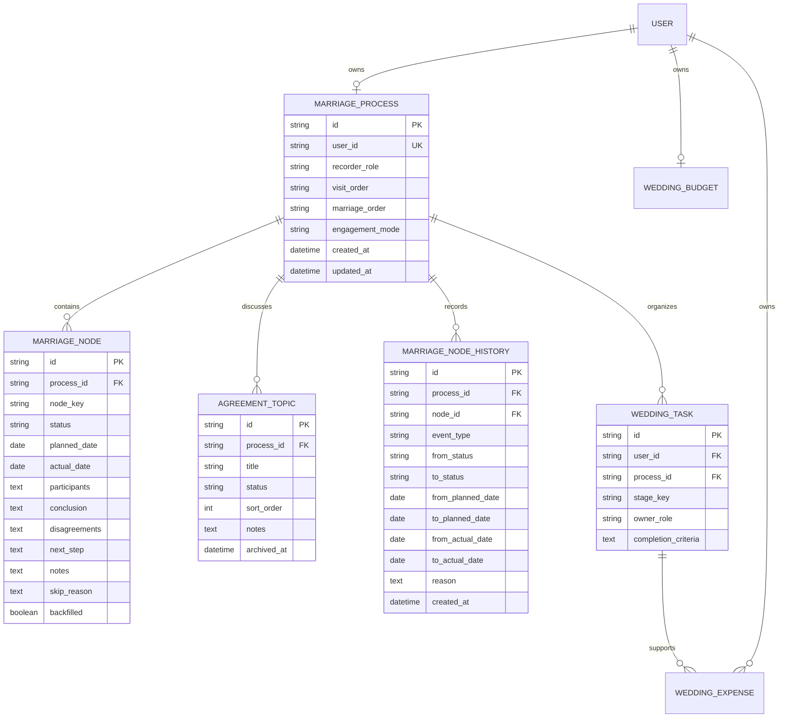
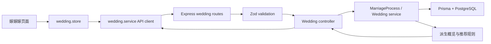

# 嫁嫁嫁婚姻进程模块开发计划

> 版本：v0.1
>
> 编制日期：2026-08-13
>
> 依据：`2026-08-13-jiajiajia-requirements.md`、`2026-08-13-jiajiajia-marriage-business-flow.html`、`2026-08-13-jiajiajia-prototype.html`
>
> 状态：开发前计划，需在实施前完成一次技术评审；本计划不代表已经开始开发或已经完成验收。

## 1. 目标与结论

### 1.1 开发目标

把当前“备婚任务、预算、花费、时间线”工作台升级为以真实婚姻场景为主线的“嫁嫁嫁”婚姻进程工作台：

> 两人确认婚姻意愿 → 男方上门 / 女方上门（先后可调，但都要完成） → 双方父母见面 → 婚姻基本共识 → 订婚（可选） → 领证与婚礼自主排序 → 两个节点分别完成 → 进入婚后生活。

系统只记录和推进用户明确确认的事实与计划，不把推荐流程当成法律顺序，不把父母意见当成审批，不把婚礼当成领证，也不因为日期到了就自动完成节点。

### 1.2 改造策略

采用“新增婚姻业务层，保留婚礼执行层”的渐进式方案：

- 新增婚姻进程、阶段节点、双方共识和节点变更历史等领域对象。
- 扩展现有 `WeddingTask`，让它成为带阶段归属、负责人和完成标准的“阶段行动项”，避免另建一套与花费关系重复的任务模型。
- 保留现有预算、花费、用户隔离、金额 Decimal 计算和删除任务后花费解除关联的能力。
- 保留旧 Wedding API 的兼容字段，先增量扩展，避免一次性删除旧字段或破坏 Dashboard 快捷入口。
- 前端首页和信息架构重做；现有任务、花费、预算对话框和数据访问模式尽量复用。

### 1.3 规模与估算

以下估算以一名熟悉当前代码的全栈开发者为基准，单位为人日，不含生产发布审批、外部系统接入和多人协作功能：

| 工作包 | 估算 | 说明 |
| --- | ---: | --- |
| 范围冻结与契约设计 | 0.5–1 | 确认字段、状态、兼容边界和验收矩阵 |
| shared 类型与枚举 | 1–1.5 | 前后端共用契约、标签和状态机输入 |
| Prisma 模型与增量迁移 | 1.5–2.5 | 新表、旧任务扩展、兼容初始化和迁移验证 |
| 后端业务层与 API | 4–6 | 节点、顺序、共识、概览、兼容接口和安全隔离 |
| 前端工作台重构 | 5–7 | 首页、阶段记录、共识、执行、设置和响应式交互 |
| 文档、自动化测试与数据兼容 | 2–3 | API、README、单测、路由测试、store 测试 |
| Ego 浏览器验收与修正 | 2–3 | 390/768/1280 三种视口和核心场景回归 |
| 合计 | **16–23** | 后端与前端可部分并行；保守排期建议 3–4 周 |

如果一期增加情侣双账号、父母账号、实时协作、附件或通知，以上估算不再适用，应单独立项。

## 2. 需求基线与边界

### 2.1 一期必须交付

- 婚姻进程建档，支持男方、女方或记录人视角。
- 8 个真实节点的状态、计划日期、实际日期和记录：确认意愿、男方上门、女方上门、双方父母见面、基本共识、订婚、领证、婚礼。
- 两次上门独立存在，未发生前可以选择男方先或女方先；两次都完成后才把父母见面显示为推荐下一步。
- 双方父母见面记录，允许补录，文案不能出现“父母审批通过”。
- 基本共识议题，默认议题可增删改名，状态为尚未讨论、讨论中、已达成共识、需再沟通。
- 订婚采用、跳过或暂不决定；跳过不产生逾期或未完成提醒。
- 领证和婚礼两个独立节点，顺序可选先领证后婚礼、先婚礼后领证、同日/临近完成；日期和实际完成分别保存。
- 阶段行动项，字段包括名称、阶段、负责人、计划日期、状态、完成标准和备注。
- 婚礼预算与花费，保留现有预计金额、确认金额/实际金额、支付状态、预算风险和历史花费。
- 首页展示当前阶段、下一步、未解决议题、临近安排、领证/婚礼顺序与预算风险。
- 390px、768px、1280px 响应式布局，保留平台现有五项移动端导航。
- 当前认证用户隔离；一期不引入情侣双账号、父母账号和协作权限。

### 2.2 明确不做

- 情侣双账号、实时协作、邀请和权限分工。
- 父母独立登录、审批、投票或“同意/拒绝婚姻”判断。
- 法律咨询、法律资格判断、自动法律提醒或替用户判断是否已经结婚。
- 供应商 CRM、合同管理、附件审查、宾客/桌位/座位/请柬完整管理。
- 日历同步、短信/微信通知、自动催办、外部支付或账单导入。
- 婚后财务合并、家庭资产管理或 Finance 模块数据自动合并。
- 附件上传；一期只预留备注或证据链接字段，附件另行评估。
- 甘特图、任务依赖、自动排期、拖拽排序和关键路径算法。

### 2.3 实施前的默认决策

这些决策用于避免开发中反复改变模型；若产品评审要调整，应在 Phase 0 结束前确定：

| 决策项 | 本计划采用的方案 | 原因 |
| --- | --- | --- |
| 进程数量 | 每个用户一个婚姻进程，不提供删除，完成后保留历史 | 符合一期个人账户模型，避免多进程切换复杂度 |
| 当前阶段 | 后端按显式节点状态和推荐规则派生，不允许系统凭日期自动推进 | 防止把计划误当事实；前端得到稳定的单一口径 |
| 阶段行动项 | 扩展 `WeddingTask`，增加进程、阶段、负责人、完成标准字段 | 保留现有花费关联和 CRUD，减少重复模型 |
| 旧数据处理 | 增量迁移，旧任务不自动推断为已完成节点；首次建档时可补录 | 不臆造用户已经发生过的婚姻事实 |
| 婚礼日期来源 | 婚礼节点的 `plannedDate` 是业务来源；有旧预算时同步保存 `WeddingBudget.weddingDate` 作为兼容镜像 | 兼容旧接口和 Dashboard，同时支持独立领证日期 |
| 领证日期 | 只存在于领证节点，不复用预算婚礼日期 | 避免把法律节点和仪式节点混成一个婚期 |
| 顺序可编辑范围 | 相关节点均未完成时可调整；任一节点完成后显示事实顺序，剩余未来日期仍可改 | 只调整未来安排，不改写已经发生的事实 |
| 完成日期 | 首次完成必须由用户明确提供或确认实际日期；重新打开不删除历史实际日期 | 满足“事实与计划分离”和可追溯要求 |
| 共识未完成 | 只产生提醒和推荐，不阻止用户补录或推进后续节点 | 真实生活并非强制闸门，系统不能替双方作决定 |
| 建档接口 | 使用幂等 `PUT /wedding/process`，已有进程时返回当前进程，不重置数据 | 避免重复点击造成 409，也不覆盖已有记录 |

## 3. 当前版本基线

### 3.1 当前代码结构

当前 `/wedding` 主要由以下垂直切片组成：

- Prisma：`WeddingTask`、`WeddingExpense`、`WeddingBudget`。
- Shared：任务、花费、预算、概览、时间线 DTO，以及 `WeddingTaskCategory`、`TaskStatus`、`PaidStatus`。
- Backend：`routes → controllers → services`，Zod 严格校验，JWT 用户隔离，金额使用 Prisma `Decimal`。
- Frontend：`wedding.store.ts`、任务看板、时间线、花费列表、概览和四类对话框。
- Dashboard：使用婚期、待办任务、已完成任务和预算余量摘要，并支持 `action=task/expense/budget` 快捷进入。

### 3.2 可以直接复用

- `WeddingExpense` 与 `WeddingTask` 的用户隔离和花费解除关联规则。
- 预算与花费金额的 Decimal 计算、超支保留负数、类别统计。
- Axios API 实例、Zustand 请求失效 token、Toast、Dialog、Button、DatePicker、Select、Textarea。
- 现有页面的加载中、空数据、错误、重试、删除确认、焦点恢复和移动端底部导航模式。
- 现有 `/api/wedding` 路由前缀、统一响应包络和 404 隔离契约。

### 3.3 不能直接沿用

- 当前首页文案和布局以“婚期、预算、备婚任务”为中心，不能只改标题。
- 当前时间线只展示任务，不能表达父母见面、共识、订婚、领证和婚礼事实。
- 当前任务状态只有待办、进行中、已完成、已取消，不能表达节点的暂缓、补录和订婚跳过。
- 当前 `WeddingBudget.weddingDate` 只有一个婚礼日期，不能承载领证日期。
- 当前任务没有阶段、负责人和完成标准，无法按真实场景组织下一步行动。
- 当前概览的任务完成率不能代替婚姻节点完成度。

## 4. 目标领域模型

### 4.1 目标关系



### 4.2 `MarriageProcess`

建议 Prisma 模型名使用 `MarriageProcess`，数据库表名使用 `marriage_processes`。一期每个用户最多一条：

| 字段 | 类型 | 规则 |
| --- | --- | --- |
| `id` | UUID | 主键 |
| `userId` | UUID | 唯一，外键级联删除 |
| `recorderRole` | String | `male`、`female`、`record_keeper`；只用于称呼和提示 |
| `visitOrder` | String | `male_first` 或 `female_first` |
| `marriageOrder` | String | `registration_first`、`wedding_first`、`same_or_near` |
| `engagementMode` | String | `adopt`、`skip`、`undecided` |
| `createdAt/updatedAt` | DateTime | 标准审计时间 |

不要保存父母身份证、联系方式等非必要敏感信息；父母和家庭只作为节点参与人、结论、分歧和备注中的业务记录出现。

### 4.3 `MarriageNode`

每个进程固定初始化 8 个节点，使用 `(processId, nodeKey)` 唯一约束。节点不是审批单，而是对真实场景的记录：

| `nodeKey` | 中文名称 | 是否允许跳过 | 说明 |
| --- | --- | --- | --- |
| `intention` | 确认以婚姻为目标 | 否 | 两个人共同决定进入家庭接触 |
| `male_visit` | 男方上门见女方家长 | 否 | 独立于女方上门 |
| `female_visit` | 女方上门见男方家长 | 否 | 独立于男方上门 |
| `parents_meeting` | 双方父母正式见面 | 否 | 见面完成不等于审批通过 |
| `agreement` | 确认婚姻基本共识 | 否 | 具体议题状态在 `AgreementTopic` 中维护 |
| `engagement` | 订婚与婚姻约定 | 是 | `skipped` 只允许此节点 |
| `registration` | 领证 | 否 | 法律节点，使用“依法办理结婚登记”等准确文案 |
| `wedding` | 婚礼筹备与婚礼 | 否 | 仪式节点，预算和执行行动项归属这里 |

节点状态：

- `not_started`：尚未开始。
- `scheduled`：已安排日期或明确安排。
- `in_progress`：正在推进。
- `completed`：用户明确确认真实完成。
- `paused`：暂缓或等待再次沟通。
- `skipped`：只用于订婚，表示明确不采用该节点。

节点字段约束：

- `plannedDate` 是准备发生的日期；`actualDate` 是真实发生的日期，二者独立。
- 完成时至少要有 `actualDate`；用户可以在表单中预填当天，但必须明确确认。
- 已完成节点重新打开时，保留历史 `actualDate`；若要纠正历史事实，必须使用明确的“纠正实际日期”操作并写历史，不由普通改顺序覆盖。
- `participants`、`conclusion`、`disagreements`、`nextStep`、`notes` 为可选文本，服务端分别限制长度，错误响应和日志不得回显完整敏感内容。
- `backfilled=true` 表示用户补录了现实中已经发生的节点；不是系统根据其他节点自动推断。
- `skipReason` 仅在订婚跳过时使用。

### 4.4 `AgreementTopic`

建档时初始化以下 6 个默认议题：

1. 是否确定进入婚姻。
2. 婚后居住城市 / 居住安排。
3. 领证与婚礼时间。
4. 婚礼规模和双方家庭参与方式。
5. 费用、礼金和预算边界。
6. 婚后家庭责任和重要生活安排。

字段和规则：

- `title`：可修改，trim 后 1–100 个字符。
- `status`：`not_discussed`、`discussing`、`agreed`、`needs_discussion`。
- `notes`：记录双方结论、分歧和下次沟通安排，不保存父母“批准”布尔值。
- `sortOrder`：用于稳定展示顺序。
- 删除采用归档方式（`archivedAt`），默认列表不展示已归档项；删除前必须确认，不影响其他节点。
- 共识状态只作为提醒和推荐依据，不能阻止用户补录订婚、领证或婚礼。

### 4.5 现有 `WeddingTask` 扩展为阶段行动项

保留现有字段和 `WeddingExpense.taskId` 关系，新增可空字段以兼容旧任务：

| 字段 | 规则 |
| --- | --- |
| `processId` | 可空，指向当前用户的 `MarriageProcess`；新流程任务应有值 |
| `stageKey` | 可空兼容旧数据；新任务使用 8 个节点之一，旧任务默认归入 `wedding` |
| `ownerRole` | `male`、`female`、`both`、`family`；旧任务默认 `both` |
| `completionCriteria` | 可选，记录完成标准，最多 500 字 |

旧的 `category` 继续保留，用于婚礼预算分类；新建阶段行动项如果不需要婚礼类别，前端传 `other`，不能删除现有非空列。

阶段行动项示例：

| 行动项 | `stageKey` | 负责人 |
| --- | --- | --- |
| 确定女方上门日期 | `female_visit` | `both` |
| 准备双方父母见面要讨论的问题 | `parents_meeting` | `both` |
| 确认婚后居住城市 | `agreement` | `both` |
| 预约结婚登记 | `registration` | `male` / `female` / `both` |
| 确认婚宴场地和档期 | `wedding` | `both` |

### 4.6 预算与日期兼容

- `WeddingBudget.totalBudget` 继续作为预算金额来源。
- `MarriageNode(nodeKey=wedding).plannedDate` 是新的婚礼计划日期来源。
- 如果已有 `WeddingBudget`，节点建档时将其日期复制为婚礼节点的计划日期；不要据此把婚礼节点标记为已完成。
- 通过旧预算接口修改婚礼日期时，在同一事务中同步婚礼节点；通过新节点接口修改婚礼日期时，如果预算存在，也同步旧预算的 `weddingDate`。
- 如果用户只设置婚礼节点日期而尚未设置预算，不创建一个虚假的 0 元预算；旧 `GET /budget` 仍可返回 `null`，新流程概览读取节点日期。
- 领证日期只保存在 `registration` 节点，不写入 `WeddingBudget`。

## 5. 状态、顺序与派生规则

### 5.1 事实与计划分离

所有服务端和前端代码遵守以下规则：

1. 计划日期到了，不自动把节点变成进行中或完成。
2. 修改 `plannedDate` 不得修改 `actualDate`。
3. 调整访问顺序或领证/婚礼顺序，不得改写已有节点的实际日期、完成记录和历史。
4. 已完成节点改为进行中时，显示明确提示并保留实际日期；再次完成时新增历史事件。
5. 不能通过父母见面记录推断“共识已达成”，不能通过婚礼完成推断“已经依法结婚”。

### 5.2 两次上门顺序

- 在男方、女方两次上门都未完成前，设置页可以选择 `male_first` 或 `female_first`。
- 任何一次上门完成后，页面以实际发生记录为事实顺序；不允许用设置覆盖已发生顺序，只能调整另一场尚未发生的计划日期。
- 两次都完成后，顺序只读，展示实际日期排序。
- 两个节点始终分别展示；只完成一次时明确提示“还差另一方上门”。
- 父母见面是否允许补录不由前置状态阻止；若前置未完成，补录请求必须带 `backfilled=true`，页面显示“用户补录”。

### 5.3 领证与婚礼顺序

- 在领证、婚礼都未完成前，可以选择三种计划顺序，并分别设置两个计划日期。
- 任一节点完成后，页面展示实际发生节点在前，未完成节点单独显示计划，不允许把设置改写成与事实相反的历史顺序。
- 领证完成、婚礼未完成时，必须显示“已领证，婚礼待完成”；不能显示“尚未结婚”。
- 婚礼完成、领证未完成时，必须显示“婚礼已完成，领证待完成”；不能显示“已依法结婚”。
- 只有两个节点都为 `completed`，首页才显示“婚姻阶段已完成 / 进入婚后生活”。

### 5.4 当前阶段和下一步

后端返回 `currentStage`、`recommendedNext`、`progress` 和 `warnings`，前端不自行复制算法：

- `progress`：8 个固定节点中，`completed` 和订婚 `skipped` 计为终态；只统计显式状态，不根据日期推断。
- `currentStage`：按推荐主线找到最早的非终态节点；如果后续节点已经补录完成，则同时返回 `outOfOrder=true` 和“已提前记录”提示，不覆盖用户事实。
- 两次上门未都完成时，推荐下一步优先是按当前事实缺少的上门节点，而不是父母见面。
- 两次上门都完成后，父母见面才成为推荐下一步；已补录父母见面时，推荐转向共识或其他未完成节点。
- 共识有 `needs_discussion` 时，只显示风险和建议，不阻止订婚、领证或婚礼记录。
- 订婚为 `skipped` 时，从下一步和逾期统计中排除。
- 领证和婚礼的下一步按用户选择的计划顺序推荐，但两个节点始终独立展示。
- 节点和行动项都没有明确完成时，首页必须显示可执行的记录入口，而不是空白或虚假的 0%。

### 5.5 风险派生

首页风险按以下优先级生成，风险只提示，不自动改状态：

1. 上门节点缺失或即将到期。
2. 父母见面已记录但存在分歧或下一步为空。
3. 共识议题处于需再沟通或尚未讨论。
4. 计划日期已过但节点未完成。
5. 预算实际花费超过预算，或预算余量不足。
6. 领证 / 婚礼计划日期未设置。

## 6. 技术架构与接口边界

### 6.1 数据流



### 6.2 新增接口

所有接口使用现有 JWT、`/api/wedding` 前缀和 `{ success, data, message? }` 响应包络。所有资源查询、更新、删除和关联校验都带当前 `userId`；不存在资源和跨用户资源统一返回 404。

| 方法 | 路径 | 用途 | 关键规则 |
| --- | --- | --- | --- |
| `GET` | `/wedding/process` | 查询当前进程 | 未建档返回 `data: null`，不因 GET 自动写库 |
| `PUT` | `/wedding/process` | 幂等建档 | 只在没有进程时初始化；已有进程不重置节点、议题或顺序 |
| `PATCH` | `/wedding/process/settings` | 更新记录人视角、上门顺序、领证/婚礼顺序、订婚选择 | 只允许修改未来安排；涉及已完成节点时返回明确校验错误或由前端只读 |
| `GET` | `/wedding/process/nodes` | 查询 8 个节点 | 固定顺序返回，附行动项数量、是否逾期和补录标记 |
| `PATCH` | `/wedding/process/nodes/:nodeKey` | 新增或更新节点记录 | `nodeKey` 白名单；完成需实际日期；订婚才允许 skipped；不自动完成前置节点 |
| `GET` | `/wedding/process/nodes/:nodeKey/history` | 查询节点历史 | 只返回当前用户当前节点历史，不返回备注全文到日志 |
| `GET` | `/wedding/process/agreements` | 查询未归档共识议题 | 按 `sortOrder`、创建时间稳定排序 |
| `POST` | `/wedding/process/agreements` | 新增议题 | 标题 trim，默认 `not_discussed` |
| `PATCH` | `/wedding/process/agreements/:id` | 更新标题、状态、备注、顺序 | 必须先以 `processId + userId` 查找 |
| `DELETE` | `/wedding/process/agreements/:id` | 归档议题 | 二次确认；不物理删除历史 |

### 6.3 现有接口的扩展方式

不删除现有接口，按兼容方式扩展：

| 现有接口 | 计划改动 |
| --- | --- |
| `GET/POST/PATCH/DELETE /wedding/tasks` | 响应增加 `processId`、`stageKey`、`ownerRole`、`completionCriteria`；请求新增可选字段，旧请求默认 `stageKey=wedding`、`ownerRole=both`、`category=other`（仅新建调用未传类别时） |
| `GET/POST/PATCH/DELETE /wedding/expenses` | 保持金额、支付状态、任务关联和用户隔离；任务关联校验继续要求任务属于当前用户 |
| `GET/PUT /wedding/budget` | 保持旧请求和响应；婚礼日期与婚礼节点计划日期事务内同步 |
| `GET /wedding/overview` | 保留旧预算/花费/任务统计，新增 `marriage` 摘要；不把任务完成率冒充婚姻进程完成度 |
| `GET /wedding/timeline` | 保留旧 `items` 任务时间线，新增节点时间线字段；旧客户端可忽略新增字段 |

建议新增的 Shared 响应结构如下，具体命名在 Phase 0 技术评审时冻结：

```ts
interface MarriageProcessResponse {
  id: string
  recorderRole: MarriageRecorderRole
  visitOrder: VisitOrder
  marriageOrder: MarriageOrder
  engagementMode: EngagementMode
  nodes: MarriageNodeResponse[]
  agreements: AgreementTopicResponse[]
  currentStage: MarriageNodeKey | null
  recommendedNext: MarriageNodeKey | null
  outOfOrder: boolean
  progress: { completed: number; total: number; percentage: number }
  warnings: MarriageWarning[]
}
```

### 6.4 校验与错误

- 日期严格 `YYYY-MM-DD`，使用项目现有 UTC round-trip 校验。
- 文本统一 trim，节点备注、结论、分歧和下一步分别限制长度；不得接受未知字段。
- `status=completed` 首次提交时必须有 `actualDate`；重新打开必须显式传非完成状态并给出前端确认。
- `status=skipped` 只允许 `engagement`；跳过时 `skipReason` 可选，其他节点传入返回 400。
- 上门顺序、婚礼顺序、记录人身份、节点键、负责人和议题状态全部使用 shared 枚举校验。
- 不能通过 `plannedDate` 自动改变节点状态，不能通过 `actualDate` 自动完成节点。
- 备注、结论、分歧等私密文本不进入请求日志、错误堆栈或公开页面。
- 不新增法律结论字段，不新增 `parentApproved`、`marriageLegal` 等容易误导的字段。

## 7. 分阶段开发计划

### Phase 0：范围冻结、基线与技术评审

**目标：** 在写代码前锁定业务语义、兼容策略和验收口径。

**任务：**

- [ ] 核对需求文档、流程图、原型五个视图的名称和节点文案。
- [ ] 冻结 `MarriageNodeKey`、节点状态、共识状态、负责人、顺序和订婚模式枚举。
- [ ] 确认 `WeddingTask` 扩展而不是新增平行行动项表。
- [ ] 确认每用户单一进程、不能删除进程、旧数据不自动推断完成状态。
- [ ] 确认婚礼节点计划日期与旧预算日期的双写/镜像策略。
- [ ] 将验收标准 MAR-001～MAR-011 拆成后端、前端、浏览器三类证据。
- [ ] 在当前工作区运行基线检查，记录当前分支、脏文件、`pnpm verify` 和 `git diff --check` 结果；不得覆盖已有未跟踪原型文档。

**交付物：**

- shared 枚举和 DTO 草案。
- Prisma 字段清单和迁移顺序草案。
- API 路由表和错误码表。
- 场景验收矩阵。

**退出条件：** 产品和技术评审确认上述默认决策；如有分歧，先更新本计划和需求文档再进入下一阶段。

### Phase 1：Shared 领域契约

**依赖：** Phase 0。

**建议改动文件：**

- `shared/src/constants/enums.ts`
- `shared/src/constants/labels.ts`
- `shared/src/types/models/wedding.ts` 或新增 `shared/src/types/models/marriage.ts`
- `shared/src/types/api/wedding.ts`
- 对应 shared 测试文件

**任务：**

- [ ] 新增 `MarriageNodeKey`、`MarriageNodeStatus`、`MarriageRecorderRole`、`VisitOrder`、`MarriageOrder`、`EngagementMode`、`AgreementStatus`、`ActionOwnerRole`、`RecordSource`。
- [ ] 定义节点、节点历史、共识议题、进程设置、概览、风险和推荐行动 DTO。
- [ ] 扩展 `WeddingTaskResponse` 和任务请求 DTO，增加阶段、负责人、完成标准字段。
- [ ] 扩展 `WeddingOverviewResponse`、`WeddingTimelineResponse`，保留现有字段并增加婚姻摘要/节点字段。
- [ ] 为所有枚举提供中文标签；法律节点和仪式节点使用区分明确的文案。
- [ ] 将请求字段设为可选还是必填写入注释，避免前后端各自猜测默认值。

**验证：**

- [ ] `pnpm --filter @xiaowoniu/shared build`
- [ ] shared 类型无重复枚举、无 `any` 绕过。
- [ ] 旧 Wedding 类型的调用方仍能通过 TypeScript 检查，新增字段采用兼容策略。

**退出条件：** 后端和前端可以基于同一组类型开始并行开发。

### Phase 2：Prisma 模型与增量迁移

**依赖：** Phase 0、Phase 1。

**建议改动文件：**

- `backend/prisma/schema.prisma`
- `backend/prisma/migrations/<timestamp>_add_marriage_process/migration.sql`
- 必要的 Prisma seed 或迁移辅助脚本

**任务：**

- [ ] 新增 `MarriageProcess`、`MarriageNode`、`AgreementTopic`、`MarriageNodeHistory` 四个模型。
- [ ] 为进程用户、节点 `(processId,nodeKey)`、议题列表、历史查询和行动项阶段建立必要索引。
- [ ] 扩展 `WeddingTask`，增加可空 `processId`、`stageKey`、`ownerRole`、`completionCriteria`，保留现有 `category`、状态和花费关系。
- [ ] 不删除、不重命名现有 Wedding 表字段，不把旧 `wedding_date` 直接改成领证日期。
- [ ] 对所有新表增加用户可达的外键级联；节点、议题、历史只能通过属于当前用户的进程访问。
- [ ] 迁移保持向后兼容：新字段尽量可空或有默认值，旧后端在新增表存在时仍可运行。
- [ ] 采用懒初始化策略：首次 `PUT /process` 时事务内创建进程、8 个节点、6 个默认议题，并把当前用户尚未归属进程的旧任务挂到 `wedding` 阶段；不根据旧任务推断节点完成。
- [ ] 如果已有 `WeddingBudget`，只复制日期到婚礼节点计划日期；不要把预算存在推断成婚礼已完成。
- [ ] 处理并发建档：利用 `userId` 唯一约束和事务，重复请求最终只得到一个进程和一套默认节点/议题。
- [ ] 对懒初始化失败设计可重试事务；不能留下只有进程没有节点、只有节点没有默认议题的半初始化状态。

**数据兼容检查：**

| 旧数据 | 新版本展示 |
| --- | --- |
| 旧任务 | 任务状态、计划日期、完成日期、类别、备注原样保留；阶段默认为婚礼执行，负责人默认为双方 |
| 旧花费 | 金额、类别、日期、支付状态和任务关联原样保留 |
| 旧预算 | 总预算原样保留；婚礼日期复制为婚礼节点计划日期 |
| 只有旧婚期没有预算 | 不构造预算；新节点可以有计划日期，预算仍为空 |
| 没有任何 Wedding 数据 | 首次进入显示建档向导，不显示虚假已完成节点 |

**验证：**

- [ ] 使用实际本地 PostgreSQL 执行 `prisma validate`、`prisma generate` 和迁移 dry-run/本地迁移。
- [ ] 用空库和含旧任务、旧花费、旧预算的数据各跑一次迁移。
- [ ] 检查迁移前后旧表行数、金额、关联和用户隔离不变。
- [ ] 检查迁移 SQL 不包含删除旧表、清空数据或宽范围 destructive 操作。

**退出条件：** 新模型可生成 Prisma Client，旧 Wedding CRUD 的数据和关联仍可读写。

### Phase 3：后端进程、节点与共识服务

**依赖：** Phase 1、Phase 2。

**建议改动文件：**

- `backend/src/routes/wedding.routes.ts`
- `backend/src/controllers/wedding.controller.ts`
- `backend/src/services/wedding.service.ts`，必要时拆出 `marriage-process.service.ts`
- `backend/src/validation/wedding.schemas.ts`
- `backend/src/__tests__/wedding.schemas.test.ts`
- 新增/扩展 `wedding.service.test.ts`、`wedding.routes.test.ts`

**任务：**

- [ ] 实现 `ensureMarriageProcess`，事务初始化节点、议题、旧任务归属和预算日期镜像。
- [ ] 实现 `GET/PUT /process`，重复 PUT 不重置用户已填写的内容。
- [ ] 实现设置更新，并在任一相关节点已完成后保护事实顺序。
- [ ] 实现节点查询、更新和历史查询。
- [ ] 实现节点状态机：完成日期、重新打开、暂缓、订婚跳过、补录标记、历史事件。
- [ ] 实现共识议题列表、新增、更新和归档。
- [ ] 所有服务方法从 `req.user!.userId` 获取用户，不接受客户端传入的 `userId` 作为授权依据。
- [ ] 对不存在进程、节点、议题、历史和跨用户资源统一 404；不在消息中透露资源是否存在于其他账户。
- [ ] 将父母见面记录建模为“见面、结论、分歧、下一步”，禁止 `approved` 或类似审批状态。
- [ ] 对后续节点的补录不自动完成前置节点；缺失前置节点只在推荐和风险中体现。

**状态机重点测试：**

- [ ] 非完成 → 完成：要求实际日期并记录历史。
- [ ] 完成 → 进行中/暂缓：保留旧实际日期并记录重新打开事件。
- [ ] 完成 → 完成：不覆盖实际日期，除非明确走事实纠正流程。
- [ ] 非订婚节点传 `skipped`：400。
- [ ] 订婚跳过：状态变为 `skipped`，不生成逾期风险。
- [ ] 计划日期变化：不改变状态或实际日期。
- [ ] 父母见面在上门之前补录：成功，但 `backfilled=true`。
- [ ] 任意服务请求访问另一个用户的进程、节点、议题或行动项：404。

**退出条件：** API 可以独立通过 HTTP 测试完成“建档 → 记录节点 → 调整设置 → 记录共识 → 查询历史”的闭环。

### Phase 4：后端概览、行动项和旧 Wedding 能力兼容

**依赖：** Phase 3。

**任务：**

- [ ] 扩展任务创建、编辑、列表和筛选，支持 `stageKey`、`ownerRole`、`completionCriteria`。
- [ ] 旧任务请求继续可用；未传阶段时默认归入 `wedding`，未传负责人时默认 `both`。
- [ ] 保留服务端维护任务完成日期的现有规则；阶段行动项不得直接提交任意 `completedDate`。
- [ ] 预算接口与婚礼节点计划日期事务内同步，防止页面出现两个不同婚礼日期。
- [ ] 概览服务增加：节点进度、当前阶段、推荐下一步、上门状态、共识风险、领证日期、婚礼日期、婚姻完成状态和预算风险。
- [ ] 原有任务完成率、预算使用率、花费类别统计继续按既有契约计算，不与节点进度混淆。
- [ ] 时间线增加节点项，保留旧任务 `items`；节点时间线区分计划日期和实际日期。
- [ ] 更新 Dashboard service：继续提供旧 `weddingDate`、倒计时、待办任务、已完成任务、预算余量，并可增加当前阶段/下一步摘要；缺少婚姻进程时不让 Dashboard 500。
- [ ] 更新 `backend/API.md`，逐条写清新增接口、字段、状态、日期、错误和向后兼容行为。

**派生数据测试：**

- [ ] 只完成一次上门时，推荐另一场上门，父母见面不显示为完成。
- [ ] 两次上门完成后，父母见面成为推荐下一步。
- [ ] 订婚跳过不计入逾期和未完成统计。
- [ ] 先领证后婚礼：领证完成、婚礼未完成，法律/仪式文案准确。
- [ ] 先婚礼后领证：婚礼完成、领证未完成，仍显示法律节点未完成。
- [ ] 领证与婚礼都完成才显示婚姻阶段完成。
- [ ] 预算超支只返回风险，不修改节点或行动项状态。
- [ ] 婚礼日期过去不自动完成婚礼节点或任务。

**退出条件：** 旧 Dashboard、旧 CRUD 和新婚姻进程概览可以在同一用户数据上同时工作。

### Phase 5：前端工作台壳层与建档向导

**依赖：** Phase 1；可与 Phase 3/4 并行，先使用 mock DTO。

**建议改动文件：**

- `frontend/src/pages/Wedding/index.tsx`
- `frontend/src/store/wedding.store.ts`
- `frontend/src/services/wedding.service.ts`
- `frontend/src/components/wedding/*`
- `frontend/src/pages/Wedding/*.test.tsx`
- `frontend/src/store/wedding.store.test.ts`

**任务：**

- [ ] 将页面一级信息架构改为：婚姻进程、阶段记录、双方共识、婚礼执行、流程设置。
- [ ] 更新页面标题和说明：从“备婚任务管理”改为“记录从见家长到结婚的真实进程”。
- [ ] 扩展 `wedding.service.ts` 和 `wedding.store.ts`，增加 process、nodes、agreements、history 和新 overview 字段。
- [ ] 保留现有请求失效 token、并发刷新、登录切换 reset、加载/错误/重试语义；写入成功后再刷新相关资源，不用未经确认的乐观状态覆盖事实。
- [ ] 未建档时显示建档向导：选择记录人视角，并说明该选择不代表谁拥有决策权。
- [ ] 支持用户建档后从任意现实阶段开始补录；向导不自动把此前节点标记完成，改为引导用户逐项记录实际日期和结论。
- [ ] 对 Dashboard `action=task/expense/budget` 做兼容：没有进程时先完成建档或进入对应引导，不丢失用户动作意图；有进程时打开对应操作。
- [ ] 更新页面内导航和移动端适配，平台五项底部导航保持不变。

**退出条件：** 空数据用户能从 `/wedding` 完成建档并进入五个视图；刷新后进程和空状态一致。

### Phase 6：阶段记录、顺序设置和双方共识界面

**依赖：** Phase 5、Phase 3 的 API。

**任务：**

- [ ] 实现首页主卡：当前阶段、推荐下一步、进程进度、风险、两次上门状态、领证/婚礼计划。
- [ ] 实现阶段记录页：8 个节点固定顺序展示，支持查看、记录、补录、修改计划和查看历史。
- [ ] 阶段记录弹窗按节点类型展示字段：
  - 上门：计划/实际日期、参与人、见面结果、待处理问题。
  - 父母见面：日期、参与人、主要结论、分歧、下一步。
  - 共识：跳转议题清单，不用“父母审批”文案。
  - 订婚：采用/跳过/暂不决定、日期、礼节、费用边界、跳过原因。
  - 领证：计划/实际日期、登记备注；使用法律节点准确文案。
  - 婚礼：计划/实际日期、仪式备注，并链接婚礼执行行动项。
- [ ] 实现流程设置：
  - 两次上门在都未完成时可选男方先或女方先。
  - 任一上门完成后显示事实顺序，不用设置覆盖实际日期。
  - 领证/婚礼均未完成时可选三种计划顺序和两个独立日期。
  - 任一节点完成后锁定历史顺序，只允许调整未完成节点的未来日期。
  - 订婚可采用、跳过或暂不决定。
- [ ] 实现共识页：默认议题、状态筛选、添加、改名、编辑备注、归档确认、未解决数量和完成度。
- [ ] 对“已达成共识”“需再沟通”“父母表达意见”使用不同文案和视觉，不显示审批按钮。
- [ ] 对已完成节点重新打开显示确认提示：保留历史实际日期，当前状态会重新进入推进状态。
- [ ] 所有成功、失败、保存和补录结果使用统一 Toast / Alert；失败不清空用户仍可修正的表单输入。

**退出条件：** 原型五个视图的主要交互都对应真实 API，不再依赖静态演示数据；两次上门和领证/婚礼顺序的状态在刷新后保持。

### Phase 7：婚礼执行、预算花费和行动项重组

**依赖：** Phase 4、Phase 5。

**任务：**

- [ ] 将“任务看板”改名为“阶段行动项”，默认展示当前阶段及其下一步行动。
- [ ] 更新任务表单：阶段、负责人、完成标准、计划日期、状态、备注；保留婚礼类别供预算统计使用。
- [ ] 支持从阶段详情直接新建行动项，并自动带入 `stageKey`。
- [ ] 婚礼执行页保留任务、预算、花费、支付状态和预算余量，但明确写出“确认金额不等于已经支付金额”。
- [ ] 预算日期展示为婚礼计划日期；领证计划日期在婚姻主线单独展示。
- [ ] 花费可以关联行动项或独立存在；删除行动项后，花费历史、金额、类别和日期保留。
- [ ] 超预算只显示风险，不自动取消行动项、不改变婚姻阶段。
- [ ] 时间线改为“婚姻节点 + 阶段行动项”双层展示，分别标识计划日期、实际日期、状态和逾期。
- [ ] 处理旧数据：已有任务进入婚礼执行阶段，不能被转换成上门、父母见面或领证记录。

**退出条件：** 旧任务、花费、预算数据可继续编辑；新行动项能挂在具体婚姻节点下，首页和执行页数据一致。

### Phase 8：自动化测试、文档和页面级 QA

**依赖：** Phase 3–7。

#### 8.1 Backend / API

- [ ] Shared 枚举、DTO 和标签测试。
- [ ] Zod schema：非法日期、反向日期、未知字段、空 PATCH、过长文本、非法状态、非法节点键、订婚外跳过、完成缺实际日期。
- [ ] Service：进程幂等初始化、默认节点/议题、旧任务归属、预算日期镜像、并发重复建档。
- [ ] Service：状态机、事实日期保护、补录、顺序保护、共识 CRUD、派生当前阶段和推荐下一步。
- [ ] Service：预算 Decimal 汇总、超支、零预算、领证/婚礼独立日期、跳过订婚统计。
- [ ] Route：所有新旧路由认证优先于校验，成功包络一致，跨用户资源统一 404。
- [ ] API 文档与实际 route table 一致，不能只改文档不改测试。

#### 8.2 Frontend / Store

- [ ] Process 为空、建档成功、建档失败和重试。
- [ ] 首页当前阶段、下一步、风险和完成度渲染。
- [ ] 上门顺序切换、任一完成后的只读事实顺序、实际日期保持。
- [ ] 领证/婚礼顺序、日期独立编辑、先领证和先婚礼两个场景。
- [ ] 节点状态、补录、已完成重新打开提示、订婚跳过。
- [ ] 共识议题添加、编辑、状态、归档和错误保留输入。
- [ ] 行动项阶段/负责人/完成标准，旧任务兼容，花费关联解除。
- [ ] Store 并发请求失效、写后刷新、用户切换 reset、失败不清空成功数据。

#### 8.3 Ego Browser 页面验收

按“先记录 BUG，再形成最终测试报告”的方式执行，不把 API 单测或 DOM 静态存在当作浏览器通过证据。至少覆盖：

| 场景 | 核验点 |
| --- | --- |
| 空数据首次进入 | 建档向导、当前阶段选择、无虚假节点完成 |
| 男方先上门 | 顺序设置、男方完成、女方待安排、下一步正确 |
| 女方先上门 | 与上一场景互换后标签、推荐和记录正确 |
| 只完成一次上门 | 另一方明确未完成，父母见面不被当作完成 |
| 父母见面补录 | 前置未完整时允许补录，并显示“用户补录” |
| 共识有分歧 | “需再沟通”可见，不出现审批通过/拒绝 |
| 跳过订婚 | 显示已跳过，不进入逾期和未完成统计 |
| 先领证后婚礼 | 领证完成后显示已领证、婚礼待完成 |
| 先婚礼后领证 | 婚礼完成后领证仍待完成，法律文案准确 |
| 两节点均完成 | 显示进入婚后生活，同时保留预算和历史入口 |
| 调整未来日期 | 未来计划变化，已经发生的实际日期不变 |
| 预算超支和删任务 | 风险显示；花费历史保留、关联解除 |
| 用户隔离 | 用户 A 不可看到或修改用户 B 的进程、节点、议题、任务、花费 |
| 390px / 768px / 1280px | 无横向溢出，按钮可点，弹窗可关闭，底部导航不遮挡内容 |
| 键盘与焦点 | Tab 顺序、焦点可见、Dialog 关闭后焦点恢复、状态有语义标签 |

**退出条件：** 自动化测试、lint、build、页面级 QA 和浏览器证据均已记录；任何失败或阻塞均有 BUG 编号和说明，未验证项不标记为通过。

### Phase 9：集成、发布准备与回滚演练

**依赖：** Phase 8。

**任务：**

- [ ] 从工作区当前实际分支和脏状态生成变更清单，确认不包含无关个人修改。
- [ ] 运行完整本地验证：`pnpm verify`、`git diff --check`。
- [ ] 使用真实本地 PostgreSQL 做迁移后 HTTP smoke test：认证、建档、节点、共识、行动项、预算、花费和隔离。
- [ ] 确认 `/health`、`/readyz`、前端 HTTP 和目标构建产物，不把启动进程当成服务通过。
- [ ] 更新 `README.md` 中嫁嫁嫁模块说明、`backend/API.md` 和 `docs/qa/page-level-test-cases.md`。
- [ ] 生成发布说明：迁移名称、数据兼容策略、已知限制、回滚方式、验收证据位置。
- [ ] 在获得明确授权前，不执行 Staging/生产迁移、发布、备份恢复或回滚。

**推荐部署顺序：**

1. 先部署只增加表和可空字段的数据库迁移。
2. 部署支持新旧字段的后端，验证健康、就绪和旧 Wedding API。
3. 验证新 API 和本地/目标环境数据读取。
4. 部署新前端页面，执行 Ego 浏览器验收。
5. 观察错误率、接口耗时、迁移状态和用户数据回读。
6. 在授权窗口内完成发布确认；不把本地通过等同于生产通过。

**回滚策略：**

- 前端异常：回滚到旧前端；新增表和可空字段不影响旧页面，旧任务/花费/预算接口继续可用。
- 后端异常：在确认新迁移只增加结构、没有删除或重命名旧字段的前提下回滚后端版本；新进程数据暂时由旧页面不可见，但不得丢失。
- 数据异常：停止继续提升版本，保留迁移、日志和回读证据，由有权限的负责人决定前向修复或恢复方案；不直接执行 `migrate reset` 或破坏性回滚。
- 回滚后必须重新检查 `/health`、`/readyz`、旧 Wedding CRUD、用户隔离和预算/花费数据。

## 8. 文件级实施清单

### 8.1 Shared

- [ ] `shared/src/constants/enums.ts`
- [ ] `shared/src/constants/labels.ts`
- [ ] `shared/src/types/models/wedding.ts` 或新增婚姻模型类型文件
- [ ] `shared/src/types/api/wedding.ts`
- [ ] shared 类型/枚举测试

### 8.2 Backend

- [ ] `backend/prisma/schema.prisma`
- [ ] 新增 Prisma migration
- [ ] `backend/src/validation/wedding.schemas.ts`
- [ ] `backend/src/routes/wedding.routes.ts`
- [ ] `backend/src/controllers/wedding.controller.ts`
- [ ] `backend/src/services/wedding.service.ts`
- [ ] 必要时新增 `backend/src/services/marriage-process.service.ts`
- [ ] `backend/src/__tests__/wedding.schemas.test.ts`
- [ ] `backend/src/__tests__/wedding.service.test.ts`
- [ ] `backend/src/__tests__/wedding.routes.test.ts`
- [ ] 如 Dashboard 摘要扩展，更新 dashboard service、类型和测试
- [ ] `backend/API.md`

### 8.3 Frontend

- [ ] `frontend/src/services/wedding.service.ts`
- [ ] `frontend/src/store/wedding.store.ts`
- [ ] `frontend/src/pages/Wedding/index.tsx`
- [ ] 新增/重构婚姻进程首页、阶段记录、共识、执行、设置组件
- [ ] 节点记录、共识议题、行动项、流程设置 Dialog
- [ ] `frontend/src/pages/Wedding/wedding-page.test.tsx`
- [ ] `frontend/src/pages/Wedding/wedding-components.test.tsx`
- [ ] `frontend/src/store/wedding.store.test.ts`
- [ ] `frontend/src/services/wedding.service.test.ts`
- [ ] `frontend/src/pages/Wedding/wedding-dialogs.test.tsx`
- [ ] `frontend/src/index.css` 或页面样式中补齐响应式和 reduced-motion 规则
- [ ] `frontend/src/pages/Dashboard.tsx` 及 Dashboard 测试（如果摘要字段或快捷动作有变化）

### 8.4 文档与 QA

- [ ] `README.md`
- [ ] `backend/API.md`
- [ ] `docs/qa/page-level-test-cases.md`
- [ ] 新增嫁嫁嫁场景测试报告和 BUG 记录；不覆盖既有 QA 证据

## 9. 风险与应对

| 风险 | 影响 | 概率 | 应对 |
| --- | --- | --- | --- |
| 把婚礼任务直接改名造成业务模型仍未改变 | 高 | 高 | 先完成进程/节点/共识模型，再重排首页；验收必须覆盖真实节点 |
| 旧预算日期与婚礼节点日期不一致 | 高 | 中 | 明确婚礼节点为业务来源；预算接口事务双写并增加一致性测试 |
| 旧任务被错误推断为已发生的婚姻节点 | 高 | 中 | 旧任务只归入婚礼执行；节点保持未开始，首次进入引导用户补录 |
| 已完成节点被改顺序覆盖实际事实 | 高 | 中 | 顺序服务层保护；完成后只读事实顺序，历史表记录状态/日期变更 |
| 父母意见被做成审批逻辑 | 高 | 中 | DTO 不提供 approval 字段；文案和验收禁止审批语义 |
| 订婚跳过仍进入逾期统计 | 中 | 中 | `skipped` 只允许订婚，派生统计统一排除终态跳过 |
| 领证和婚礼共用一个日期字段 | 高 | 高 | 两个节点独立保存计划/实际日期；API 和 UI 分开展示 |
| 新前端发布时后端未完成迁移 | 高 | 中 | 先 additive migration、后兼容后端、最后前端；发布前做 readyz 和 schema 检查 |
| `WeddingTask` 新字段破坏旧 Dashboard 快捷操作 | 中 | 中 | 新字段可空、有默认值；保留旧 route 和 action；增加回归测试 |
| 备注和分歧内容出现在日志或错误中 | 高 | 低 | Zod 限长、统一错误消息、日志脱敏、不记录请求体 |
| 前端自行派生当前阶段导致 API 与页面不一致 | 中 | 中 | 当前阶段、推荐下一步、风险由后端统一派生，前端只渲染 |
| 移动端五项导航或弹窗焦点回归 | 中 | 中 | 保持现有导航组件，执行 390px Ego 和键盘/焦点用例 |
| 迁移在错误数据库上执行 | 高 | 中 | 迁移前检查实际 PostgreSQL listener、数据库、备份和负责人；不修改 `.env` 代替确认 |

## 10. 验收标准映射

| 需求验收 | 实现位置 | 自动化证据 | 浏览器证据 |
| --- | --- | --- | --- |
| MAR-001 空数据建档 | process API、建档向导 | route/service/page tests | 空数据进入 `/wedding` |
| MAR-002 调整上门顺序 | process settings、首页顺序卡 | service/store tests | 男方先/女方先切换 |
| MAR-003 只完成一次上门 | 节点派生推荐 | service/component tests | 缺少另一方上门提示 |
| MAR-004 父母见面补录 | node patch + backfilled | schema/service tests | 前置未完整仍可补录 |
| MAR-005 共识分歧 | agreement API/UI | route/component tests | 需再沟通，无审批文案 |
| MAR-006 跳过订婚 | engagement state | service/page tests | 跳过不逾期 |
| MAR-007 先领证后婚礼 | 独立 registration/wedding nodes | service/page tests | 已领证、婚礼待完成 |
| MAR-008 先婚礼后领证 | 独立节点和法律文案 | service/page tests | 婚礼完成、领证待完成 |
| MAR-009 调整未来日期 | date/history rules | service tests | 实际日期不变 |
| MAR-010 两节点均完成 | marriage completion derivation | service/component tests | 进入婚后生活 |
| MAR-011 390px | responsive layout | component/style checks | Ego 390px 无溢出 |

## 11. 完成定义（Definition of Done）

只有同时满足以下条件，才能将本期标记为完成：

- [ ] 所有一期必须功能已经实现，暂不纳入项没有被隐式加入。
- [ ] 新旧数据兼容策略已执行并通过回读；没有自动臆造历史完成状态。
- [ ] 所有新 API 已更新 `backend/API.md`，路由认证、校验、用户隔离和 404 行为有测试。
- [ ] 节点状态、实际日期、顺序、订婚跳过、领证/婚礼独立状态均有服务层测试。
- [ ] 前端五个视图、加载/空/错误/成功/重试、Dialog 焦点和移动端布局有测试或浏览器证据。
- [ ] 已使用 Ego Browser 完成 390px、768px、1280px 的核心场景验收；自动化证据与浏览器证据分开保存。
- [ ] BUG 先记录、测试结束后输出测试报告；未验证和阻塞项不写成通过。
- [ ] 本地 `pnpm verify`、`git diff --check` 和真实本地 HTTP smoke test 通过。
- [ ] 未经明确授权没有执行 Staging/生产迁移、发布、备份恢复、回滚或提交无关改动。

## 12. 计划评审清单

实施前由产品、后端、前端和 QA 各自确认：

- [ ] 产品确认：推荐流程不是强制流程；父母不是审批人；订婚可跳过；领证和婚礼可自主排序。
- [ ] 产品确认：当前阶段、下一步、风险提示的文案不制造法律或家庭关系结论。
- [ ] 后端确认：进程唯一性、节点唯一性、懒初始化并发安全、用户隔离和迁移兼容。
- [ ] 后端确认：婚礼日期镜像策略、Decimal 聚合和状态机边界。
- [ ] 前端确认：原型五个视图的交互都能映射到 API；无静态演示数据依赖。
- [ ] QA 确认：MAR-001～MAR-011 均有可执行用例和明确证据类型。
- [ ] 运维确认：迁移目标、备份、观察窗口、回滚授权人和目标环境尚未默认授权，需单独确认。

